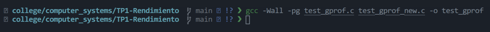
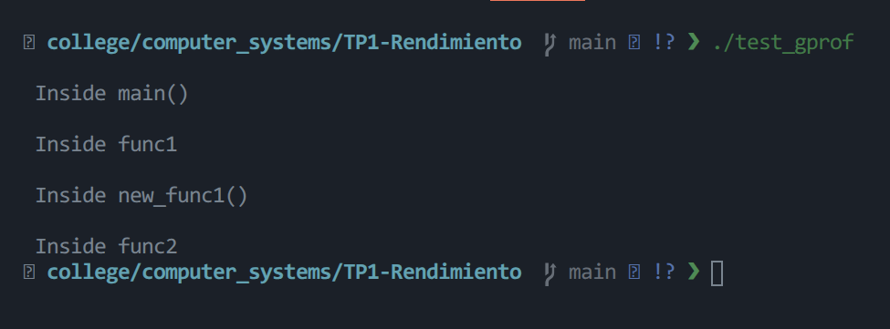
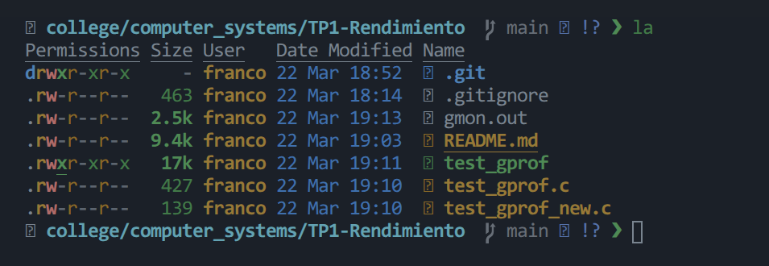
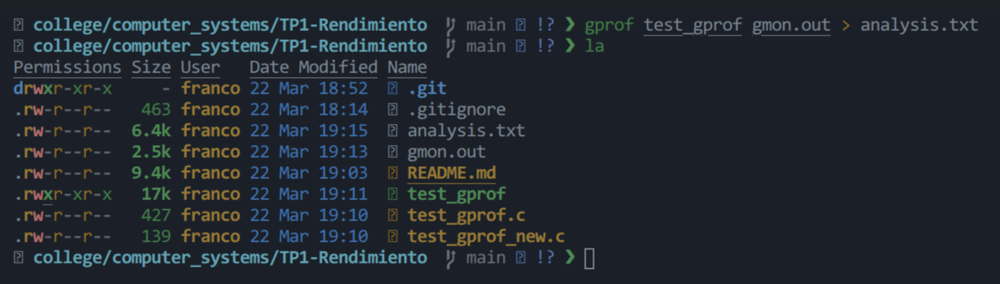
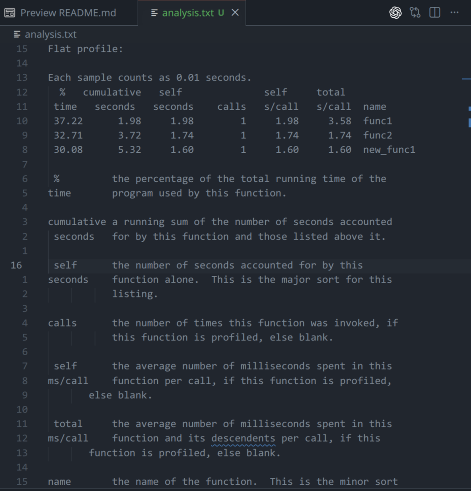
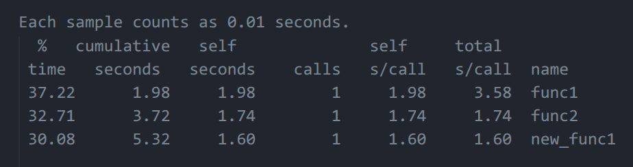
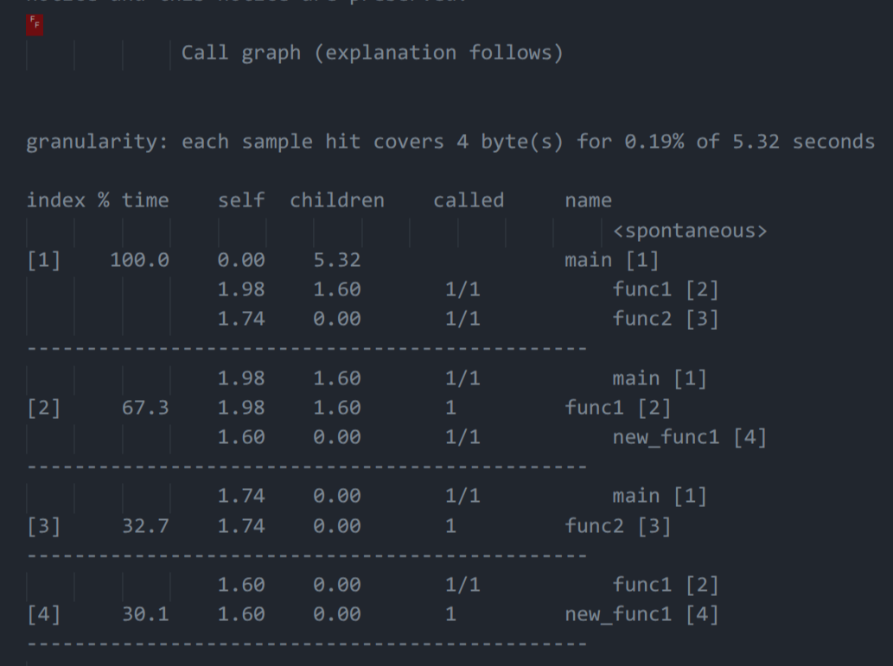
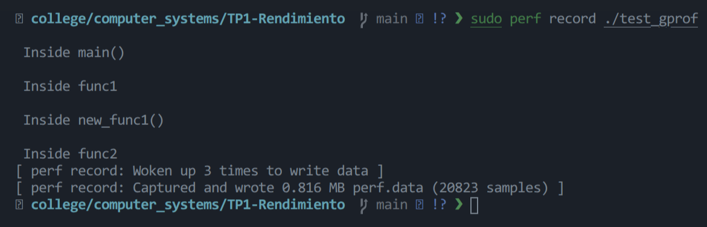
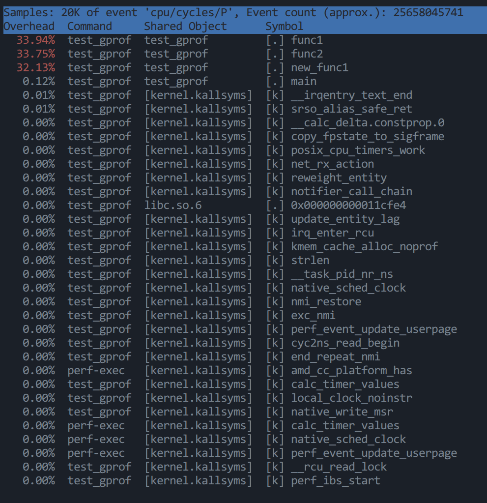

# TP1-Rendimiento

## Estructura del repositorio

- `src/`: códigos fuente en C del experimento (`test_gprof.c`, `test_gprof_new.c`).
- `pio_src/`: firmware del experimento en ESP8266 para PlatformIO (`main.cpp`).
- `platformio.ini`: configuración del proyecto PlatformIO.
- `results/`: salidas de análisis generadas (`analysis.txt`).
- `images/`: capturas usadas en el informe.

## Parte 1: Benchmarks y tareas diarias

### 1.1 Lista de benchmarks

No todos los benchmarks sirven para lo mismo. Algunos miden rendimiento general del procesador, otros el almacenamiento, otros la GPU, y otros representan mejor tareas reales, como compilar código, ejecutar programas o trabajar con aplicaciones específicas. Por eso, para determinar cuáles son más útiles, es necesario relacionarlos con el tipo de tareas que realiza cada usuario.

#### 1.1.1 Benchmarks propuestos

- **Phoronix Test Suite / OpenBenchmarking – build-linux-kernel**

    Mide cuánto tarda el sistema en compilar el kernel de Linux. Es especialmente útil para comparar procesadores en tareas de compilación real en entornos Linux. ([OpenBenchmarking][1])

- **Geekbench 6**

    Mide rendimiento de CPU en single-core y multi-core, y se usa como benchmark general para comparar equipos de forma rápida entre distintas plataformas. ([Geekbench][2])

- **Cinebench**

    Evalúa el rendimiento de CPU y GPU usando cargas de renderizado basadas en el motor de Maxon. Es útil para ver desempeño sostenido en tareas pesadas de cómputo. ([Cinebench][3])

- **Blender Benchmark**

    Mide qué tan rápido un CPU o GPU puede renderizar escenas con Cycles. Es muy representativo para modelado 3D, render y creación de contenido visual. ([Blender][4])

- **fio**

    Es una herramienta de benchmark de entrada/salida que permite simular cargas de trabajo de disco. Sirve para evaluar almacenamiento, por ejemplo en accesos aleatorios, secuenciales o cargas parecidas a bases de datos, máquinas virtuales o compilaciones grandes. ([fio.readthedocs.io][5])

- **PCMark 10**

    Mide rendimiento general del sistema en tareas de oficina y productividad usando actividades inspiradas en uso real. Es útil para equipos usados principalmente en navegación, documentos, videollamadas y multitarea liviana. ([Benchmarks UL][6])

- **3DMark**

    Está orientado a cargas gráficas y gaming, incluyendo pruebas con ray tracing. Es útil cuando interesa medir rendimiento gráfico más que productividad o compilación. ([Benchmarks UL][7])

#### 1.1.2 Benchmarks más útiles para mí

Como estudiante de Ingeniería en Computación, considero que los benchmarks más útiles para mí son:

- **build-linux-kernel**
- **fio**
- **Geekbench 6**

El benchmark **build-linux-kernel** me resulta especialmente útil porque representa una tarea cercana al trabajo real de desarrollo: la compilación de software. Dado que muchas de mis actividades están relacionadas con programación y uso de herramientas sobre Linux, este benchmark permite evaluar el rendimiento del procesador en un escenario realista.

Por otro lado, **fio** también es importante porque mide el rendimiento del almacenamiento. En tareas como compilar proyectos, manejar repositorios, trabajar con contenedores o usar máquinas virtuales, la velocidad de lectura y escritura del disco influye de manera significativa en el desempeño general del sistema.

Finalmente, **Geekbench 6** me resulta útil como referencia general del rendimiento del procesador, tanto en tareas de un núcleo como multinúcleo. Aunque no representa una tarea específica de mi uso diario, sirve como medida complementaria para comparar equipos de forma más general.

#### 1.1.3 Benchmarks que mejor representan mis tareas diarias

Los benchmarks que mejor representan mis tareas diarias serían:

- **build-linux-kernel**
- **fio**

Esto se debe a que mis actividades habituales incluyen programación, compilación de código, uso de Linux, ejecución de herramientas de desarrollo y trabajo con una gran cantidad de archivos. En ese contexto, un benchmark de compilación y uno de rendimiento de almacenamiento reflejan mejor el uso real de mi computadora que otros benchmarks más orientados a renderizado gráfico o gaming.

En cambio, pruebas como **Cinebench**, **Blender Benchmark** y **3DMark** resultan menos representativas en mi caso, ya que están más asociadas a tareas de renderizado 3D, procesamiento gráfico o videojuegos, que no forman parte central de mis actividades cotidianas.

### 1.2 Relación entre tareas diarias y benchmarks

<table style="margin: 0 auto 16px auto;">
    <thead>
        <tr>
            <th>Tarea diaria</th>
            <th>Benchmark que mejor la representa</th>
        </tr>
    </thead>
    <tbody>
        <tr><td>Compilar proyectos de programación (C/C++/Java)</td><td><strong>Build Linux Kernel</strong></td></tr>
        <tr><td>Construir proyectos grandes con muchas dependencias</td><td><strong>Build Linux Kernel</strong></td></tr>
        <tr><td>Trabajar con repositorios grandes y muchos archivos</td><td><strong>fio</strong></td></tr>
        <tr><td>Usar máquinas virtuales o contenedores</td><td><strong>fio</strong></td></tr>
        <tr><td>Copiar, descomprimir y mover grandes volúmenes de archivos</td><td><strong>fio</strong></td></tr>
    </tbody>
</table>

### 1.3 Comparación del rendimiento para compilar el kernel de Linux

Tomando como referencia el benchmark **Timed Linux Kernel Compilation 6.1 — Build: defconfig** del perfil **`pts/build-linux-kernel-1.15.0`**, se utilizaron resultados públicos de OpenBenchmarking para estimar estos tiempos promedio de compilación del kernel de Linux. ([OpenBenchmarking][8])

En este informe se trabajó de forma consistente con la versión **1.15.0** del test.

<table style="margin: 0 auto 16px auto;">
    <thead>
        <tr>
            <th>Procesador</th>
            <th>Tiempo (s)</th>
            <th>Variación (s)</th>
        </tr>
    </thead>
    <tbody>
        <tr><td>Intel Core i5-13600K</td><td>72</td><td>±5</td></tr>
        <tr><td>AMD Ryzen 9 5900X 12-Core</td><td>76</td><td>±8</td></tr>
    </tbody>
</table>

Dado que en este benchmark se compara el **tiempo de compilación**, el procesador con **menor tiempo** presenta mejor rendimiento. Por lo tanto, el **Intel Core i5-13600K** ofrece un mejor desempeño que el **AMD Ryzen 9 5900X 12-Core** en esta tarea, ya que completa la compilación aproximadamente **4 segundos antes**. Esa diferencia equivale a una mejora de alrededor del **5,3 %** en tiempo de compilación respecto del Ryzen 9 5900X. ([OpenBenchmarking][8])

Si se expresa la comparación como aceleración o *speedup* del i5-13600K respecto del Ryzen 9 5900X, se obtiene:

$$\text{aceleración} = \frac{76}{72} \approx 1{,}06$$

Es decir, en este benchmark el **Intel Core i5-13600K es aproximadamente 1,06 veces más rápido** que el **AMD Ryzen 9 5900X 12-Core**. Este resultado debe interpretarse como una referencia general, ya que OpenBenchmarking construye sus tablas a partir de **resultados públicos aportados por usuarios**, por lo que pueden existir variaciones según la configuración de cada sistema. ([OpenBenchmarking][8])

### 1.4 Cálculo de la aceleración al usar un AMD Ryzen 9 7950X 16-Core

Tomando como referencia resultados públicos agregados en OpenBenchmarking para el benchmark **Timed Linux Kernel Compilation 6.1 — Build: defconfig** del perfil **`pts/build-linux-kernel-1.15.0`**, se estiman estos tiempos promedio de compilación del kernel de Linux para el **AMD Ryzen 9 7950X 16-Core**. ([OpenBenchmarking][8])

<table style="margin: 0 auto 16px auto;">
    <thead>
        <tr>
            <th>Procesador</th>
            <th>Tiempo (s)</th>
            <th>Variación (s)</th>
        </tr>
    </thead>
    <tbody>
        <tr><td>Intel Core i5-13600K</td><td>72</td><td>±5</td></tr>
        <tr><td>AMD Ryzen 9 5900X 12-Core</td><td>76</td><td>±8</td></tr>
        <tr><td>AMD Ryzen 9 7950X 16-Core</td><td>50</td><td>±6</td></tr>
    </tbody>
</table>

Dado que en este benchmark se compara el **tiempo de compilación**, el procesador con **menor tiempo** presenta mejor rendimiento. Por lo tanto, el **AMD Ryzen 9 7950X 16-Core** ofrece un desempeño superior a los otros dos procesadores en esta tarea. ([OpenBenchmarking][8])

Si se toma como base el **Intel Core i5-13600K**, la aceleración del **Ryzen 9 7950X** es:

$$\text{aceleración}=\frac{72}{50}=1{,}44$$

Es decir, el **Ryzen 9 7950X es aproximadamente 1,44 veces más rápido** que el **Intel Core i5-13600K** en esta prueba. En términos de tiempo, esto equivale a una reducción aproximada del **30,6 %** en el tiempo de compilación. ([OpenBenchmarking][8])

Si se toma como base el **AMD Ryzen 9 5900X 12-Core**, la aceleración del **Ryzen 9 7950X** es:

$$\text{aceleración}=\frac{76}{50}=1{,}52$$

En este caso, el **Ryzen 9 7950X es aproximadamente 1,52 veces más rápido** que el **AMD Ryzen 9 5900X**. La reducción del tiempo de compilación es de aproximadamente **34,2 %**. ([OpenBenchmarking][8])

## Parte 2: Análisis de resultados

### 2.1 Introducción

Además de analizar benchmarks de terceros, en esta segunda parte del trabajo se utilizaron herramientas de profiling para medir el rendimiento de un programa propio. El objetivo fue observar qué funciones consumen más tiempo de ejecución y obtener una visión más precisa del comportamiento del programa en tiempo real.

Para este análisis se utilizaron dos herramientas: **gprof** y **perf**.  

La herramienta **gprof** permite generar un perfil de ejecución a partir de instrumentación agregada durante la compilación, mientras que **perf** permite realizar profiling estadístico por muestreo, lo cual resulta útil para observar el comportamiento del programa con menor sobrecarga.

### 2.2 Códigos en C utilizados

Para esta parte del trabajo se utilizaron los siguientes archivos fuente:

- `src/test_gprof.c`: contiene `main`, `func1` y `func2`.
- `src/test_gprof_new.c`: contiene la función `new_func1`, invocada desde `func1`.

Ambos archivos se compilaron juntos para generar el ejecutable analizado con `gprof` y `perf`.

**Código principal (`src/test_gprof.c`)**

```c
#include<stdio.h>

void new_func1(void);

void func1(void)
{
    printf("\n Inside func1 \n");
    int i = 0;

    for(;i<0xffffffff;i++);
    new_func1();

    return;
}

static void func2(void)
{
    printf("\n Inside func2 \n");
    int i = 0;

    for(;i<0xffffffaa;i++);
    return;
}

int main(void)
{
    printf("\n Inside main()\n");
    int i = 0;

    for(;i<0xffffff;i++);
    func1();
    func2();

    return 0;
}
```
<p align="center" style="margin: 2px 0 12px 0;"><sub>Código 1: Fuente principal <code>src/test_gprof.c</code>.</sub></p>

**Código auxiliar (`src/test_gprof_new.c`)**

```c
#include<stdio.h>

void new_func1(void)
{
    printf("\n Inside new_func1()\n");
    int i = 0;

    for(;i<0xffffffee;i++);

    return;
}
```
<p align="center" style="margin: 2px 0 12px 0;"><sub>Código 2: Fuente auxiliar <code>src/test_gprof_new.c</code>.</sub></p>

### 2.3 Profiling con gprof

#### Paso 1 — Compilación con profiling habilitado

Para utilizar `gprof`, primero fue necesario compilar el programa con la opción `-pg`, que habilita la recolección de datos de profiling durante la ejecución.

```bash
gcc -Wall -pg src/test_gprof.c src/test_gprof_new.c -o test_gprof
```

<p align="center" style="margin: 0;">
    
</p>
<p align="center" style="margin: 2px 0 12px 0;"><sub>Figura 1: Compilación con <code>-pg</code>.</sub></p>

---

#### Paso 2 — Ejecución del programa

Luego se ejecutó el binario generado para producir el archivo `gmon.out`, que contiene la información recolectada durante la ejecución.

```bash
./test_gprof
```

<p align="center" style="margin: 0;">
    
</p>
<p align="center" style="margin: 2px 0 12px 0;"><sub>Figura 2: Ejecución del programa.</sub></p>

Después de ejecutar el programa, se verificó la generación del archivo `gmon.out`.

<p align="center" style="margin: 0;">
    
</p>
<p align="center" style="margin: 2px 0 12px 0;"><sub>Figura 3: Generación de <code>gmon.out</code>.</sub></p>

---

#### Paso 3 — Generación del reporte con gprof

Una vez obtenido el archivo `gmon.out`, se utilizó `gprof` para generar un archivo de análisis legible.

```bash
gprof test_gprof gmon.out > results/analysis.txt
```

<p align="center" style="margin: 0;">
    
</p>
<p align="center" style="margin: 2px 0 12px 0;"><sub>Figura 4: Ejecución de <code>gprof</code>.</sub></p>

<p align="center" style="margin: 0;">
    
</p>
<p align="center" style="margin: 2px 0 12px 0;"><sub>Figura 5: Salida de <code>results/analysis.txt</code>.</sub></p>

### 2.4 Interpretación del reporte de gprof

El reporte generado por `gprof` contiene principalmente dos secciones importantes:

#### Flat profile

El **flat profile** muestra cuánto tiempo consumió cada función de manera individual, cuántas veces fue llamada y el tiempo promedio por llamada. Esta sección permite identificar rápidamente cuáles son las funciones más costosas en términos de tiempo de ejecución.

En este caso, `gprof` reportó un tiempo total aproximado de **5,32 s**, distribuido así:

<table style="margin: 0 auto 16px auto;">
    <thead>
        <tr>
            <th>Función</th>
            <th>% del tiempo</th>
            <th>Tiempo propio (s)</th>
            <th>Llamadas</th>
            <th>Tiempo total por llamada (s)</th>
        </tr>
    </thead>
    <tbody>
        <tr><td><code>func1</code></td><td>37,22 %</td><td>1,98</td><td>1</td><td>3,58</td></tr>
        <tr><td><code>func2</code></td><td>32,71 %</td><td>1,74</td><td>1</td><td>1,74</td></tr>
        <tr><td><code>new_func1</code></td><td>30,08 %</td><td>1,60</td><td>1</td><td>1,60</td></tr>
    </tbody>
</table>

<p align="center" style="margin: 0;">
    
</p>
<p align="center" style="margin: 2px 0 12px 0;"><sub>Figura 6: Sección Flat profile de <code>results/analysis.txt</code>.</sub></p>

#### Call graph

El **call graph** muestra las relaciones de llamada entre funciones. Permite observar qué funciones llaman a otras y cómo se reparte el tiempo total entre ellas y sus subrutinas. Esta vista es útil para entender no solo qué función consume tiempo, sino también de dónde proviene ese consumo.

Según el call graph:

- `main` concentra el 100 % del tiempo total y llama una vez a `func1` y una vez a `func2`.
- `func1` aporta **67,3 %** del tiempo total (1,98 s propios + 1,60 s en su hija `new_func1`).
- `func2` aporta **32,7 %** del tiempo total (1,74 s propios).
- `new_func1` es llamada por `func1` una vez y aporta **30,1 %** del tiempo total (1,60 s propios).

<p align="center" style="margin: 0;">
    
</p>
<p align="center" style="margin: 2px 0 12px 0;"><sub>Figura 7: Sección Call graph de <code>results/analysis.txt</code>.</sub></p>

### 2.5 Observaciones a partir de gprof

A partir del análisis del reporte, se observó que el tiempo de ejecución se concentra en tres funciones, cada una llamada una sola vez:

En particular, en el **flat profile** se puede ver que las funciones más costosas fueron:

- **func1**: 37,22 % (1,98 s propios) y 3,58 s totales incluyendo `new_func1`.
- **func2**: 32,71 % (1,74 s propios).
- **new_func1**: 30,08 % (1,60 s propios).

Estas tres funciones explican prácticamente el **100 %** del tiempo total medido (5,32 s), por lo que representan los principales candidatos a optimización.

Por otro lado, el **call graph** mostró que `func1` no solo consume tiempo por su propio bucle, sino también por la llamada a `new_func1`. Por eso su tiempo total acumulado es mayor que su tiempo propio y aparece como la ruta más costosa del programa (`main -> func1 -> new_func1`).

### 2.6 Profiling con perf

Además de `gprof`, se utilizó la herramienta `perf`, que realiza profiling por muestreo.

#### Paso 1 — Registro de la ejecución

Para registrar la ejecución del programa con `perf`, se utilizó el siguiente comando:

```bash
sudo perf record ./test_gprof
```

<p align="center" style="margin: 0;">
    
</p>
<p align="center" style="margin: 2px 0 12px 0;"><sub>Figura 8: Ejecución de <code>perf record</code>.</sub></p>

En la ejecución registrada, `perf` informó:

- `Woken up 3 times to write data`
- `Captured and wrote 0,816 MB perf.data (20823 samples)`

---

#### Paso 2 — Visualización del reporte

Luego, para analizar los resultados obtenidos, se ejecutó:

```bash
sudo perf report
```

Esto permitió visualizar un reporte con las funciones que más tiempo consumieron durante la ejecución del programa.

En el resumen de `perf report` se observaron, como símbolos principales del ejecutable:

- `func1`: **33,94 %**
- `func2`: **33,75 %**
- `new_func1`: **32,13 %**
- `main`: **0,12 %**

Además, el encabezado del reporte indica aproximadamente:

- `Samples: 20K of event 'cpu/cycles/P'`
- `Event count (approx.): 25658045741`

<p align="center" style="margin: 0;">
    
</p>
<p align="center" style="margin: 2px 0 12px 0;"><sub>Figura 9: Salida de <code>perf report</code>.</sub></p>

### 2.7 Comparación entre gprof y perf

Ambas herramientas permitieron identificar las mismas funciones críticas, pero con enfoques distintos.

<table style="margin: 0 auto 16px auto;">
    <thead>
        <tr>
            <th>Herramienta</th>
            <th>Tipo de medición</th>
            <th>Resultado principal en este trabajo</th>
        </tr>
    </thead>
    <tbody>
        <tr>
            <td><strong>gprof</strong></td>
            <td>Instrumentación (<code>-pg</code>)</td>
            <td><code>func1</code> 37,22 %, <code>func2</code> 32,71 %, <code>new_func1</code> 30,08 %. Además muestra call graph (<code>main -> func1 -> new_func1</code>).</td>
        </tr>
        <tr>
            <td><strong>perf</strong></td>
            <td>Muestreo (<code>cpu/cycles/P</code>)</td>
            <td><code>func1</code> 33,94 %, <code>func2</code> 33,75 %, <code>new_func1</code> 32,13 % con 20K muestras.</td>
        </tr>
    </tbody>
</table>

En términos prácticos, **gprof** fue más útil para interpretar la estructura de llamadas y separar tiempo propio vs tiempo en funciones hijas, mientras que **perf** confirmó el mismo patrón de costo con una distribución más pareja por muestreo.

La coincidencia entre ambos reportes aumenta la confianza en el diagnóstico: el mayor costo del programa está concentrado en `func1`, `func2` y `new_func1`.

### 2.8 Conclusiones

El uso de herramientas de profiling permitió analizar de forma experimental el rendimiento del programa y verificar qué partes del código consumen más tiempo.

A partir de los resultados obtenidos con **gprof** y **perf**, se identificó de manera consistente que las funciones más costosas son `func1`, `func2` y `new_func1`.

En **gprof** se observó:

- `func1`: 37,22 % (1,98 s propios; 3,58 s totales con su descendencia).
- `func2`: 32,71 % (1,74 s).
- `new_func1`: 30,08 % (1,60 s).

En **perf** se observó una distribución similar:

- `func1`: 33,94 %.
- `func2`: 33,75 %.
- `new_func1`: 32,13 %.

El call graph de `gprof` mostró además que el costo de `func1` está compuesto por trabajo propio y por la llamada a `new_func1`, por lo que optimizar solo una función aislada no siempre refleja el costo total real.

Como conclusión general, el profiling permitió reemplazar suposiciones por evidencia cuantitativa y localizar con precisión los cuellos de botella principales del programa. Como trabajo futuro, se pueden optimizar los bucles de estas funciones y repetir la medición para comparar el impacto antes y después de los cambios.

## Parte 3: Variación de frecuencia en ESP8266

### 3.1 Objetivo

Evaluar cómo cambia el tiempo de ejecución al duplicar la frecuencia del CPU en ESP8266, manteniendo el mismo código y la misma cantidad de iteraciones.

- Carga 1: suma de enteros en bucle (`N_INT = 90000000`).
- Carga 2: suma de float en bucle (`N_FLOAT = 90000000`).
- Frecuencias a comparar: 80 MHz y 160 MHz.

Se haran 5 corridas por frecuencia para cada tipo de carga y se usara el promedio como valor de referencia.

### 3.2 Fundamento teórico

Según el marco teórico del práctico, el rendimiento de un sistema se analiza a partir del tiempo de ejecución: menor tiempo implica mayor rendimiento.

$$R \propto \frac{1}{T}$$

Para el procesador, los parámetros clave son frecuencia de CPU ($f_{CPU}$), período de CPU ($T_{CPU}=1/f_{CPU}$), CPI y cantidad de instrucciones. Si se mantiene la misma carga de trabajo (mismo programa y mismas iteraciones), el tiempo de ejecución puede aproximarse por:

$$T \approx \frac{N_{ciclos}}{f}$$

Por eso, al duplicar la frecuencia ($f_2 = 2f_1$), idealmente el tiempo se reduce a la mitad ($T_2 \approx T_1/2$).

El speedup es la razon entre rendimiento mejorado y rendimiento original:

$$S = \frac{R_{mejorado}}{R_{original}}$$

Como $R \propto 1/T$, para la misma carga se usa de forma equivalente:

$$S = \frac{T_{original}}{T_{mejorado}}$$

Aunque el caso ideal al duplicar frecuencia da $S=2$, en la practica puede ser menor por sobrecostos fijos (arranque, llamadas, interrupciones, perifericos y serial) y por componentes que no escalan estrictamente con CPU.

### 3.3 Código de prueba (ESP8266)

Proyecto PlatformIO:

- Configuración: `platformio.ini`
- Firmware: `pio_src/main.cpp`

El siguiente programa mide tiempos de bucles enteros y float en 80 MHz y 160 MHz, con 5 corridas por frecuencia:

```cpp
#include <Arduino.h>

extern "C" {
#include <user_interface.h>
}

volatile uint32_t sink_u32 = 0;
volatile float sink_f32 = 0.0f;

const uint32_t N_INT = 90000000UL;
const uint32_t N_FLOAT = 90000000UL;
const uint8_t RUNS = 5;

uint32_t run_int_loop() {
    uint32_t t0 = micros();
    uint32_t acc = 0;

    for (uint32_t i = 0; i < N_INT; ++i) {
        acc += (i & 0x7U);
        if ((i & 0xFFFFFU) == 0) {
            ESP.wdtFeed();
        }
    }

    sink_u32 = acc;
    return micros() - t0;
}

uint32_t run_float_loop() {
    uint32_t t0 = micros();
    float acc = 0.0f;

    for (uint32_t i = 0; i < N_FLOAT; ++i) {
        acc += 0.1f;
        if ((i & 0xFFFFFU) == 0) {
            ESP.wdtFeed();
        }
    }

    sink_f32 = acc;
    return micros() - t0;
}

void set_cpu_freq_mhz(uint8_t mhz) {
    if (mhz == 160U) {
        system_update_cpu_freq(SYS_CPU_160MHZ);
    } else {
        system_update_cpu_freq(SYS_CPU_80MHZ);
    }
}

void run_once(uint8_t mhz, uint8_t run_id) {
    set_cpu_freq_mhz(mhz);
    delay(100);

    uint32_t t_int_us = run_int_loop();
    uint32_t t_float_us = run_float_loop();

    Serial.printf(
            "run=%u cpu=%u MHz int=%.3f s float=%.3f s\n",
            run_id,
            (unsigned int)system_get_cpu_freq(),
            (double)t_int_us / 1000000.0,
            (double)t_float_us / 1000000.0);
}

void setup() {
    Serial.begin(115200);
    delay(1000);

    Serial.println("ESP8266 frequency scaling benchmark");
    Serial.printf("N_INT=%lu N_FLOAT=%lu RUNS=%u\n",
                                (unsigned long)N_INT,
                                (unsigned long)N_FLOAT,
                                (unsigned int)RUNS);

    for (uint8_t r = 1; r <= RUNS; ++r) {
        run_once(80U, r);
    }
    for (uint8_t r = 1; r <= RUNS; ++r) {
        run_once(160U, r);
    }

    Serial.println("done");
}

void loop() {}
```

Comandos (PlatformIO):

```bash
pio run
pio run -t upload
pio device monitor -b 115200
```

Notas:

- Se usan variables `volatile` para evitar que el compilador elimine trabajo de los bucles.
- No se imprime dentro del bucle para no contaminar la medición.
- Se alimenta el watchdog periódicamente con `ESP.wdtFeed()` para evitar reset durante corridas largas.
- `N_INT` y `N_FLOAT` se pueden ajustar para mantener cada corrida en un rango de 5 a 15 segundos.
- En ESP8266, `float` suele tener mayor costo que enteros por no contar con FPU de precisión simple.

### 3.4 Procedimiento experimental

1. Cargar el programa en la placa ESP8266 y abrir monitor serie.
2. Medir en 80 MHz: ejecutar 5 corridas para enteros y 5 corridas para float.
3. Medir en 160 MHz: repetir exactamente el mismo esquema de 5 corridas.
4. Registrar todos los tiempos en segundos y calcular promedio por caso.
5. Verificar que los tiempos de cada corrida queden en un rango razonable (ideal: 5 a 15 s); si no, ajustar `N_INT` y `N_FLOAT` y repetir.

Formula usada para speedup:

$$S=\frac{T_{f\,baja}}{T_{f\,alta}}$$

### 3.5 Resultados (ejemplo)

Mediciones reales (5 corridas por frecuencia):

- 80 MHz: `int = 11.250 s` y `float = 66.546 s` en las 5 corridas.
- 160 MHz: `int = 5.625 s` y `float = 33.273 s` en las 5 corridas.

Como todas las corridas dieron el mismo valor, el promedio coincide exactamente con cada medición.

<table style="margin: 0 auto 16px auto;">
        <thead>
                <tr>
                        <th>Frecuencia</th>
                        <th>Tiempo enteros (s)</th>
                        <th>Tiempo float (s)</th>
                </tr>
        </thead>
        <tbody>
            <tr><td>80 MHz</td><td>11,250</td><td>66,546</td></tr>
            <tr><td>160 MHz</td><td>5,625</td><td>33,273</td></tr>
        </tbody>
</table>

Cálculo de speedup para enteros:

$$S_{int}=\frac{11{,}250}{5{,}625}=2{,}00$$

Cálculo de speedup para float:

$$S_{float}=\frac{66{,}546}{33{,}273}=2{,}00$$

### 3.6 Respuesta a la consigna

Al duplicar la frecuencia del ESP8266 de 80 MHz a 160 MHz, el tiempo de ejecución se redujo exactamente a la mitad en ambas cargas (enteros y float), lo que implica un speedup de 2,00.

- Enteros: de 11,250 s a 5,625 s (mejora 2x).
- Float: de 66,546 s a 33,273 s (mejora 2x, aunque con costo absoluto mucho mayor que enteros).
- Límites y fuentes de error: posible variación entre placas, temperatura, carga del sistema y overhead de entorno; en esta corrida no se observó dispersión entre repeticiones.

[1]: https://openbenchmarking.org/test/pts/build-linux-kernel-1.15.0 "Timed Linux Kernel Compilation Benchmark"
[2]: https://www.geekbench.com "Geekbench 6 - Cross-Platform Benchmark"
[3]: https://support.maxon.net/hc/en-us/articles/10400659216156-What-you-need-to-know-about-Cinebench-2024 "What you need to know about Cinebench 2024"
[4]: https://opendata.blender.org/about "Blender - Open Data"
[5]: https://fio.readthedocs.io/en/latest/fio_doc.html "1. fio - Flexible I/O tester rev. 3.41 - FIO's documentation!"
[6]: https://benchmarks.ul.com/pcmark10 "PCMark 10 - The Complete Benchmark for the Modern Office"
[7]: https://benchmarks.ul.com/3dmark "3DMark benchmark for Windows, Android and iOS"
[8]: https://openbenchmarking.org/test/pts/build-linux-kernel%26eval%3D9cdcd82c9c47af9df17263e4312f634338dbf476 "Timed Linux Kernel Compilation Benchmark"